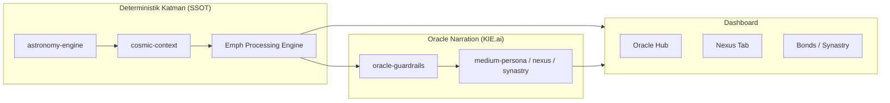

# AstroTag — Mimari Özet

> Son güncelleme: 2026-06-08  
> Teknik detay: [`system-blueprint.json`](./system-blueprint.json)

## Ürün Özeti

AstroTag, NFC anahtarlık ile açılan bir kozmik danışmanlık uygulamasıdır. Kullanıcı doğum verisi + anlık gökyüzü hesapları üzerinden **Oracle** modülleri (Natal, Tarot, Horary) ve **Nexus** günlük akışı sunar.

---

## Katmanlar



| Katman | Sorumluluk | SSOT |
|--------|------------|------|
| Ephemeris | Gezegen dereceleri, evler, transitler | `astronomy-engine` |
| Emph | JSON paketleri (natal, transit, gerilim, tarot sembolizmi) | `emph-processing-engine.ts` |
| Oracle Narration | JSON → hikâye (Türkçe metin) | KIE.ai + `oracle-guardrails.ts` |
| UI | Kullanıcı deneyimi, hata sınırları | React / Next.js App Router |

**Kaldırılan:** `astronomia` paketi — prod ve test kodundan tamamen çıkarıldı.

---

## Oracle Marka Modeli

Tüm yorumlama gücü **Oracle** markası altında toplanır:

| Modül | UI adı | Pipeline |
|-------|--------|----------|
| Natal Chart | Doğum Haritası | `astrology-interpretation.ts` |
| Tarot | Tarot (eski: AI Tarot) | `tarot-pipeline.ts` → Emph → Medyum |
| Horary | Anlık Kozmik Soru | `horary-pipeline.ts` → Emph → Medyum |
| Kozmik Profil | Kozmik Profil | `cosmic-profile-pipeline.ts` → Emph (`complexity`) → Medyum |
| Nexus | Günlük kehanet | `nexus.ts` → `buildNexusEmphPackage` |

Arayüz ve kodda "AI Tarot" / `AITarot*` isimlendirmesi kaldırıldı.

---

## JSON Guardrail (Narration SSOT)

Dosya: `src/lib/ai/oracle-guardrails.ts`

Tüm Oracle narration system prompt'larına eklenen kural:

- Yalnızca verilen JSON'u hikâyeleştir
- Harita/transit verisi dışına çıkma
- Teknik veriyi değiştiren yorum yapma
- Çelişki varsa sessiz kal

Uygulandığı yerler: `medium-persona.ts`, `nexus.ts`, `synastry.ts`, `astrology-interpretation.ts`, `tarot.ts`, `tarot-pipeline.ts`, `horary-pipeline.ts`, `tarot-constants.ts`.

Emph motoru deterministik hesap yapar; guardrail narration katmanındadır (`emph-processing-engine.ts` başlığında referans).

---

## Nexus + Transit Entegrasyonu

**Önceki boşluk:** Nexus yalnızca Güneş burcuna dayanıyordu.

**Güncel akış:**

1. `buildNexusEmphPackage(userData, dateKey)` — `src/lib/nexus/nexus-emph.server.ts`
2. Girdiler: `buildCosmicAnalysisContext`, `computeNexusTransitStress`, `detectCosmicTensions`
3. Çıktı paketi: `natalChart`, `transitsToNatal`, `transitPlanets`, `transitStress`, `cosmicTensions`, `narrativeSeeds`
4. `requestNexusDaily` — paketi KIE'ye gönderir; Güneş burcu yalnızca profil etiketi

---

## Synastry Skor (Algoritmik)

- Skor: `synastry-score-engine.ts` (astronomy-engine + aspect engine)
- Oracle narration: yalnızca metin (`synastry.ts`); skor hesaplamaz
- Top 8 aspect + kategori tavanları (±32 / ±12 / ±10)

---

## Kozmik Profil + Geri Bildirim & İade

Oracle Hub modal modülü — `CosmicProfilePanel.tsx`

### Akış

1. Form: İsim, doğum tarihi/saati, il/ilçe → `resolveBirthPlace` + `calculateNatalChart` (Emph içinde)
2. Yıldız seviyeleri: Giriş (5), Derinlik (15), Detaylı (30)
3. Yetersiz bakiye → `/dashboard/star-packages`
4. `processCosmicProfileThroughEmph(userData, name, complexity)` — seviyeye göre aspect/transit/gerilim dilimi
5. `runCosmicProfilePipeline` → Oracle narration (guardrail + tier bazlı `maxTokens`)
6. Harcama: `stars_ledger` (`COSMIC_PROFILE_*`); iade: `REFUND_ANALYSIS` (+20 yıldız bonus)

### Geri bildirim

| Cevap | Davranış |
|-------|----------|
| Evet | "Kozmik Günlüğüme Kaydet" aktif — AES-256-GCM şifreli arşiv |
| Hayır | 20 yıldız iade, analiz kaydedilmez, `Hatalı_AI_Çıktısı` teknik log |

Gizlilik UI: analiz sonucu geçicidir; kayıt yalnızca kullanıcı onayı ile.

### Dosyalar

- `src/lib/actions/cosmic-profile.ts` — analiz, geri bildirim, arşiv
- `src/lib/stars/stars-ledger.server.ts` — yıldız defteri
- `src/lib/crypto/cosmic-journal-crypto.server.ts` — encryption-at-rest
- `src/lib/cosmic-profile/feedback-log.server.ts` — hatalı çıktı logu
- `supabase/migrations/20260608120000_cosmic_profile_stars_ledger.sql`

---

## Hata Yakalama (Oracle)

| Bileşen | Dosya |
|---------|-------|
| Kullanıcı mesajı | `ORACLE_COSMIC_DATA_ERROR` — `src/lib/oracle/oracle-errors.ts` |
| Loglama | `logOracleModuleError(module, error, context)` |
| React sınırı | `OracleModuleErrorBoundary` — Natal, Tarot, Horary, Kozmik Profil |

Mesaj: *"Kozmik veri akışı şu an doğrulanamıyor. Lütfen kısa süre sonra tekrar deneyin."*

---

## Bilinen Boşluklar (Kapalı)

| Boşluk | Durum |
|--------|-------|
| Çift ephemeris (`astronomia` + `astronomy-engine`) | ✅ Kaldırıldı |
| Nexus Güneş-only | ✅ Emph transit paketi |
| AI narration JSON sapması | ✅ Guardrail tüm narrators |
| "AI Tarot" marka tutarsızlığı | ✅ Tarot + Oracle |
| Oracle hesaplama hataları | ✅ Error boundary + standart mesaj |

---

## Dizin Referansı

```
src/lib/astrology/          — ephemeris, cosmic-context, Emph
src/lib/ai/                   — Oracle narration, guardrails, pipelines
src/lib/nexus/                — Nexus Emph paketi, transit stress
src/lib/cosmic-profile/       — tier tipleri, geri bildirim logu
src/lib/stars/                  — stars_ledger
src/lib/crypto/                 — Kozmik Günlük şifreleme
src/lib/synastry/             — synastry hesap + skor
src/components/oracle/        — OracleModuleErrorBoundary
src/components/navigation/    — OracleHub
docs/system-blueprint.json    — tam teknik blueprint
```
